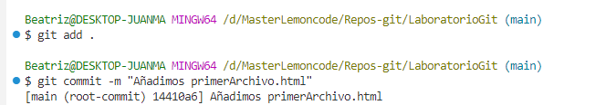
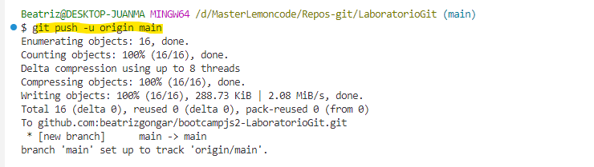
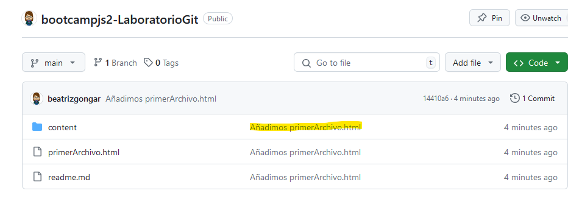
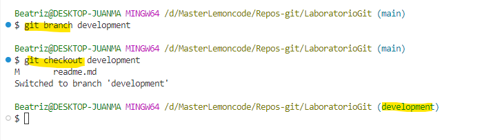
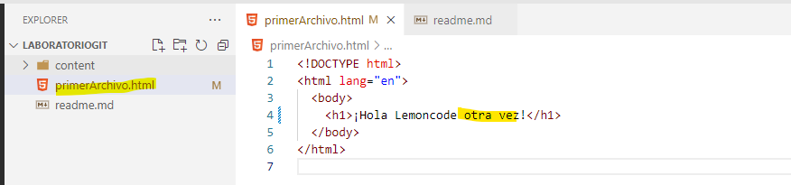
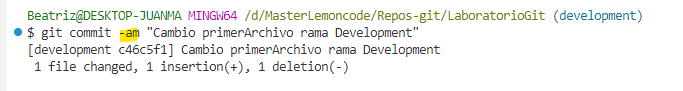
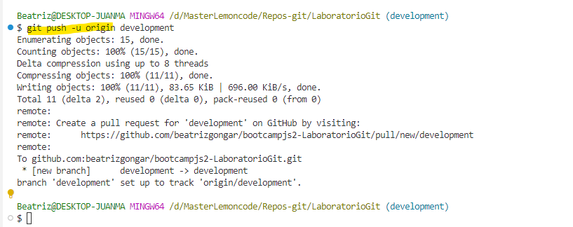
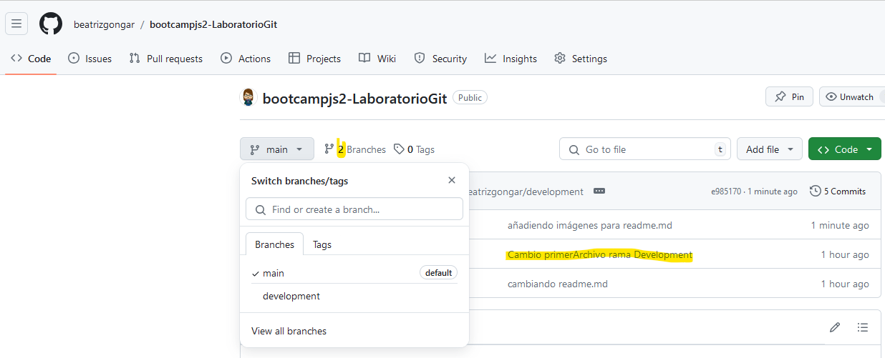
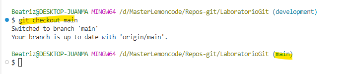

## Laboratorio Git Beatriz Gonzalez Garcia

## 1. Crear un repositorio en local

Primero abrimos el  terminal en Visual Studio y navegamos hasta el directorio donde crearemos el repositorio

**D:\MasterLemoncode\Repos-git**

> cd ..
>
> cd d:\masterlemoncode
>
> cd repos-git

Creamos la carpeta con el nombre del repositorio LaboratorioGit

También se puede crear desde línea de comandos con

> mkdir LaboratorioGit

Vamos a la carpeta que acabamos de crear

> cd LaboratorioGit/

Inicializamos el repositorio

> git init

## 2. Subir el repositorio a GitHub

Para ello primero creamos un repositorio en GitHub

Informamos el nombre del repositorio, una breve descripción y elegimos que sea Público

Una vez creado copiamos la dirección SSH para poder asociarlo a nuestro repositorio en local

Conectamos el repositorio de local con el que acabamos de crear en GitHub

> git remote add origin git@github.com:beatrizgongar/bootcampjs2-LaboratorioGit.git

Y comprobamos que la conexión se ha establecido correctamente

> git remote -v

## 3. Hacer un commit y un push

Primero creamos un archivo en la carpeta del repositorio

Y le llamamos primerArchivo.html

Informamos el HTML

Añadimos el archivo al staging

> git add .

He incluimos un commit

> git commit -m "Añadimos primerArchivo.html"

Y subimos los cambios al repositorio de GitHub

> git push -u origin main

Actualizamos el repositorio en GitHub y aparecen los cambios

## 4. Crear una rama

Creamos una rama "development" desde la rama main

> git branch development

Y nos cambiamos a la rama development

> git checkout development

Hacemos cambios en el archivo

Añadimos y hacemos commit con los cambios en la rama development

Subimos los cambios a GitHub

Y después de hacer el PR los cambios se recogen en GitHub

## 5. Hacer un merge

Primero volvemos a la rama main

